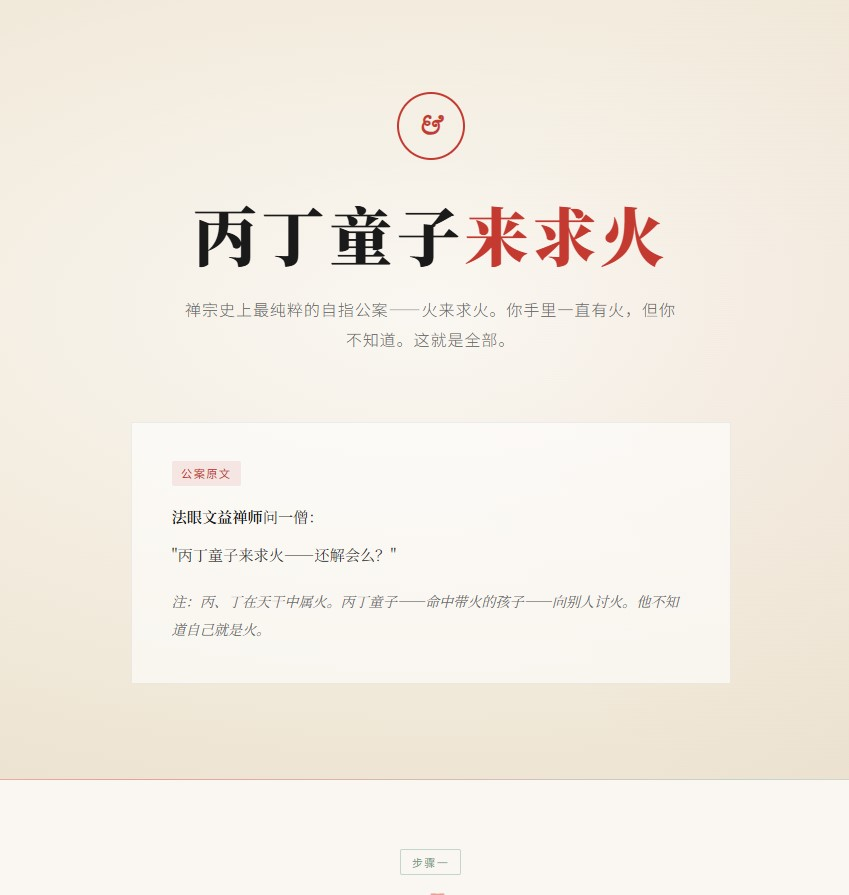

# chanzong &mdash; Zen Koan Dialectical Analysis

<p align="center">
  <em>A structured AI skill for analyzing Zen (Chan) koans through the lens of Hofstadter's strange loops, the Five Schools' verification systems, and multi-framework dialectical thinking.</em>
</p>

<p align="center">
  
</p>

---

## What Is This?

**chanzong** is an AI skill that transforms how you engage with Zen koans. It doesn't just explain what a koan *means* &mdash; it reveals the **self-referential structure** that makes the koan work. It maps koans onto the Five Schools' diagnostic systems (Linji, Caodong, Yunmen, Weiyang, Fayan), and shows you not just *what* to see, but *where* you are standing when you look.

Built on the design philosophy of the *bianzheng* dialectical thinking engine, chanzong inherits its "teach the AI how to think, not what to say" architecture, refined specifically for Zen koan analysis.

## Who Is This For?

- **Zen practitioners** &mdash; a structured companion for *canchan* (koan investigation) that identifies where you're stuck, what false realizations look like, and how to move forward
- **Buddhist studies scholars** &mdash; a systematic framework for cross-school comparison of koan structures
- **AI prompt engineering enthusiasts** &mdash; a case study in domain-specific skill design built on Hofstadter, Lakoff, and Wittgenstein

## How It Works

The skill loads automatically when you share a koan. It runs a **7-step analysis**:

| Step | Name | What It Does |
|------|------|-------------|
| I | **辩体** | School attribution, koan type, lineage, and complexity assessment |
| II | **自指检测** | Identifies which of 5 self-reference types the koan employs, draws a strange-loop diagram |
| III | **框架深剖** | Deep analysis using 3-4 frameworks selected from a pool of 12 (GEB, Conceptual Metaphor, Language Games, Autopoiesis, and 8 more) |
| IV | **框架碰撞** | Adversarial dialogue between frameworks, revealing tensions no single framework can capture |
| V | **五家勘验** | Cross-references the koan against all Five Schools' verification systems |
| VI | **修行指引** | Practice guidance: entry points, common false realizations, daily probes, self-checks |
| VII | **元反思** | Turns the analysis on itself &mdash; a structured "self-destruct" that prevents mistaking analysis for realization |

### The 12-Framework Pool

| Tier | Frameworks | Quota |
|------|-----------|-------|
| **A: Core** | GEB Strange Loops, Conceptual Metaphor, Language Games | ≥2 (GEB required) |
| **B: Five Schools** | Linji: Four Guests & Host / Four Seizures / Three Mysteries; Caodong: Five Ranks / Three Leakages; Yunmen: Three Phrases; Weiyang: 96 Circles; Fayan: Six Characteristics | ≥1 |
| **C: Cross-Domain** | Autopoiesis, Bisociation, Evolutionary Algorithm | ≥1 |

Every framework in Tiers A and C has a **Zen-specific question pool** &mdash; not generic prompts, but questions rewritten for koan analysis (e.g., "At which level are the diagnosed affliction and the diagnosing awareness the same thing?").

## Example Output

The skill produces beautifully typeset HTML with ink-wash aesthetics. Below is an excerpt from the analysis of *Bing-Ding Boy Asks for Fire* (丙丁童子来求火) &mdash; Zen's purest self-referential koan:

> **Strange Loop Diagram**
>
> **[Phenomenal layer]** The Bing-Ding boy believes he "has no fire" &mdash; he searches outward for fire. The student believes he "has no awakening" &mdash; he searches outward for the Dharma.
>
> ↓ *searching outward*
>
> **[Cognitive layer]** The boy treats "fire" as an external object to be acquired. The student treats "awakening" as an external state to be granted.
>
> ↓ *Master Fayan asks: "The Bing-Ding boy comes asking for fire &mdash; do you understand?"*
>
> **[Awareness layer]** Bing-Ding = Fire. The boy himself IS fire. His very life is the thing he seeks. The capacity to "seek" is itself the fire.
>
> ↓
>
> **【Pivot】** "Bing-Ding belongs to fire" &mdash; when the student realizes his name already contains the answer.
>
> ↓
>
> **【Collapse】** Not "found fire" &mdash; but discovered that the act of "searching" was never valid. Fire does not need to search for fire.

## Installation

```bash
# Clone the repository into your skills directory
git clone https://github.com/arahanter/chanzong.git $HOME/.agents/skills/chanzong
```

The skill auto-detects koan content in your messages. No explicit command needed &mdash; just share a koan.

## Design Philosophy

> *The analyst stands outside the koan &mdash; until discovering they are inside it.*

chanzong is built on one principle: a complete, rigorous analysis followed by a **structured self-destruct**. The seven steps build an airtight structural understanding of the koan &mdash; then Step VII turns the blade inward, acknowledging that the analysis itself is "holding a fire while complaining about the dark." Every output ends with a self-referential question that leaves the reader, not the koan, as the subject.

## License

MIT &copy; 2026 arahanter. See [LICENSE](./LICENSE).

---

<br>

# chanzong &mdash; 禅宗公案辩证分析技能

<p align="center">
  <em>基于侯世达奇异循环理论、五家勘验体系与多框架辩证思维，对禅宗公案进行学术级结构分析与修行实践指引的 AI 技能。</em>
</p>

---

## 这是什么

**chanzong** 是一个 AI 技能，它改变了你与禅宗公案互动的方式。它不只是在解释公案"在说什么"——它揭示公案**为什么能起作用的底层自指结构**。它将公案映射到五家勘验体系（临济、曹洞、云门、沩仰、法眼），不仅告诉你"看什么"，更告诉你"你站在哪里在看"。

chanzong 基于 *bianzheng*（辩证思维引擎）的设计哲学构建——继承了其"教AI怎么思考，而非告诉AI说什么"的核心架构，并针对禅宗公案分析做了完整的特化移植。

## 适合谁用

- **禅宗实修者**——一个结构化的参究工具，帮你识别卡在哪里、假悟长什么样、下一步怎么走
- **佛教学术研究者**——一个公案结构的跨宗派系统化比较框架
- **AI 提示词工程爱好者**——一个基于侯世达、Lakoff、维特根斯坦的领域特化技能设计案例

## 核心架构

技能在你分享公案时自动加载，执行**七步分析**：

| 步骤 | 名称 | 功能 |
|------|------|------|
| 一 | **辩体** | 宗门归属、公案类型、法脉关系、学人根器、复杂度判定 |
| 二 | **自指检测** | 匹配5种自指类型（火求火/二元互依/自我递归/语言自毁/循环引证），绘制奇异循环图 |
| 三 | **框架深剖** | 从12框架池中选3-6个做独立深度分析（GEB、概念隐喻、语言游戏、自创生等） |
| 四 | **框架碰撞** | 让不同框架的结论互相攻击，产生任何单一框架无法产出的涌现问题 |
| 五 | **五家勘验** | 临济四宾主/四料简/三玄三要、曹洞君臣五位/三渗漏、云门三句/一字关、沩仰圆相、法眼六相义——全部对照 |
| 六 | **修行指引** | 以"你"为主体：参究入手处、易犯假悟（三渗漏格式）、日常可操作探针、自检问题 |
| 七 | **元反思+温和自毁** | 用公案自己的逻辑反问分析本身——"你花了3000字分析'吃茶去'，现在你去泡茶了吗？" |

### 12框架三档配额

| 档位 | 框架 | 最低配额 |
|------|------|---------|
| **A: 核心分析** | GEB奇异循环、概念隐喻、语言游戏 | ≥2（①必选） |
| **B: 五家勘验** | 临济三套/曹洞两套/云门两套/沩仰圆相/法眼六相 | ≥1 |
| **C: 跨界冷门** | 自创生、异类联想、演化算法 | ≥1 |

A档和C档的每个框架都配有**禅宗专属追问池**——不是通用提问，而是针对公案分析重写的追问（如"被诊断的'烦恼'和能诊断的'觉性'在哪个层次上是同一个东西？"）。

## 技能文件

```
chanzong/
├── SKILL.md              # 主技能（七步法+配额规则+输出规范）
├── frameworks.md          # 12框架禅宗专属追问池
├── five-schools.md        # 五家勘验体系详解（定义+识别信号+案例）
├── zen-self-ref.md        # 自指类型库（5种类型+循环图模板+经典案例）
├── html-template.html     # HTML输出固定模板（禅宗美学CSS）
└── LICENSE                # MIT 开源协议
```

## 示例输出

技能输出精美的HTML排版，采用水墨禅意美学（墨黑、宣纸暖白、朱砂红点缀、青瓷绿辅色）。上方截图展示了"丙丁童子来求火"——禅宗史上最纯粹的自指公案——的完整分析。

## 安装

```bash
git clone https://github.com/arahanter/chanzong.git ~/.agents/skills/chanzong
```

技能会自动检测你消息中的公案内容，无需显式调用——直接分享一段公案即可。

## 设计哲学

> *分析者站在公案之外——直到发现自己也在公案之中。*

chanzong 的核心设计原则：**先做一份严谨到无懈可击的完整分析，然后在最后一步进行结构化自毁。** 前六步建立一个密不透风的结构理解——然后第七步把刀锋转向自身。温和自毁开关不是"谦虚地承认分析的局限"，而是用公案自己的逻辑反问分析本身。如果分析完"吃茶去"后你继续读下一篇分析而不是去泡茶——这3000字就骗了你。

## 开源协议

MIT &copy; 2026 arahanter. 详见 [LICENSE](./LICENSE)。
